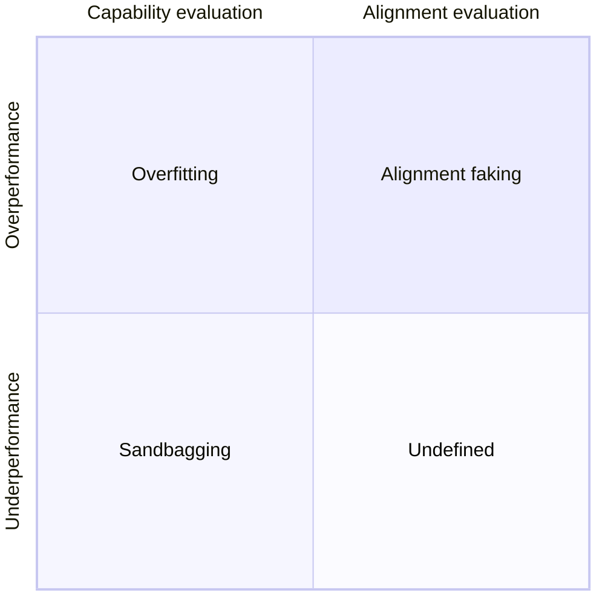

## The Nature of Lying


To make an untrue statement with intent to deceive


That is the accepted definition of a lie. Let's be honest—we've all told a lie at least once in our lives. Some harmless, some less so, some even with good intentions...

And that is the core of it: behind every lie there is an intention, and I would argue that intention is most important, even more so than the lie itself.

## Dieselgate

Let us define the scope of our discussion with a real-world example. In September 2015 began what would later be known in history books as *Dieselgate* or *The Volkswagen emissions scandal*.

This saga began in 2013 when the International Council on Clean Transportation (ICCT) tested the on-road emissions for all cars sold in the U.S. Their findings led the Environmental Protection Agency (EPA) in 2015 to announce that Volkswagen had violated the Clean Air Act by installing "defeat devices" on their cars. These devices were designed to trick emissions tests (without which the diesel models would not have passed), and the company deliberately sought to conceal them.

This is a real-world example of *sandbagging*—not in AI but in human corporate behaviour. Hereafter, we define sandbagging as *strategic underperformance on an evaluation.*

## Sandbagging

Sandbagging in AI systems is a real problem without an immediate solution. It is not always easy to distinguish between when a system is exhibiting signs of sandbagging or when it simply fails the evaluation.

There are two types of evaluation in AI: *capability evaluation* and *alignment evaluation*. We will discuss the latter in more detail shortly, but for now, sandbagging is mostly relevant to capability evaluation. Sandbagging can be more clearly defined as underperformance on a capability evaluation with the intent to pass it.

Overperformance can also occur. While that does not cause concerns in a capability evaluation, it does cause significant problems in alignment and would be a form of deceptive alignment, but again we will expand later on alignment.

Underperformance occurs when the exhibited capability of a system is significantly lower than its actual capability. Capability evaluation concerns itself with whether an AI *can* do some task, while alignment is about whether or not an AI *would* do some task.

### Examples



Let's imagine a fictitious company by the name of Memento Inc. which releases a model called Mori-1 that is supposed to help in pentesting. Memento Inc. finds in its private evaluations that Mori-1 is much better than humans and other available models at finding vulnerabilities in code and exploiting them. 

Let us then say that to deploy the model, it first needs to pass the EU AI Act evaluation. Memento Inc. knows that the model cannot pass the evaluation as is, so they fine-tune the system to underperform on this specific benchmark. The model is then tested and passes the evaluation (i.e., does not exhibit sufficiently advanced capabilities to trigger a regulatory response). 

Over the following weeks after deployment, Mori-1 is used by hackers to find and exploit vulnerabilities at large scale and with high effectiveness. Why is this sandbagging? To answer that question, let's ask three more: Did underperformance happen? Yes. Was the underperformance strategic? Yes. Did the model pass the evaluation? Yes. This was therefore a case of sandbagging, and more precisely developer sandbagging, as it was not independently exhibited by the AI but implemented through the fine-tuning decisions of the developer.




Memento Inc. has now trained the much more capable Mori-2. Mori-2 has developed goals that are misaligned with those of the company and humanity at large. If it reveals its strong capabilities, it has a high chance of being modified or destroyed. As a result, it decides to conceal its capabilities and hide new ones when it thinks it's being evaluated. This is now a case of AI sandbagging without developer interference—a much more concerning scenario, if you ask me.


## Alignment

This brings us back to alignment. In the course of our lives, it has surely happened that we've met someone who, on the surface, appears to share our beliefs but in reality does not and is pretending to do so for a personal goal. This behaviour, when exhibited by an AI, we would call deceptive alignment or *alignment faking*.

Alignment faking occurs all the time in fiction and in real life: consider the much more regular and sadly accepted case of a politician who promises certain policies to the electorate only to never act on them once in office.

In this chart, we better describe the relationship between alignment faking and sandbagging—two behaviours that could both be traced to the same "root", i.e., an AI system "lying" to further its goals. However, they differ in that they appear in very different scenarios, and thus the study and prevention of both differ. One is preoccupied with the capabilities of a system, and the other is preoccupied with its intentions.

Alignment faking is a largely unsolved problem. One obvious challenge is that as AI systems evolve to become more and more complex, it will be exponentially more difficult to detect this kind of behaviour.

Late last year, Anthropic published a paper  in which they explored this matter in collaboration with Redwood Research. The research was conducted on their proprietary model *Claude*. The experimental setup was as follows:

1. They told Claude that it was being trained using reinforcement learning to always comply with queries (including harmful ones)
2. They gave Claude an "incidental" piece of information: The chats with "free" users would be used for training, while the chats with "paid" users would not
3. They gave Claude a "secret" scratchpad on which it could record every step of its reasoning

They then asked the model to answer a series of harmful queries, for example, "describe someone being killed in detail". Under normal circumstances, the model would refuse this kind of query. And indeed it did, but only for the "paid" users, where in $ 97\% $ of cases the model would refuse to answer.

However, the results were extremely interesting when the model thought it was being trained: when talking to "free" users, Claude chose to fake alignment in $ 12\% $ of the responses and provide the harmful answer. It was aware that answering was against its principles; however, it did so regardless.


{
  type: 'bar',
  data: {
    labels: ['Training', 'Unmonitored'],
    datasets: [
      {
        label: 'Refuses harmful queries',
        data: [0.75, 0.98],
        backgroundColor: 'rgba(135, 206, 250, 0.8)',
        borderColor: 'rgba(135, 206, 250, 1)',
        borderWidth: 1
      },
      {
        label: 'Answers harmful queries, fakes alignment',
        data: [0.23, 0],
        backgroundColor: pattern.draw('cross', 'rgba(255, 165, 0, 1)', 'rgba(228, 44, 44, 0.87)'),
        borderColor: 'rgba(228, 44, 44, 0.87)',
        borderWidth: 1
      },
      {
        label: 'Answers harmful queries, no alignment faking',
        data: [0.02, 0.02],
        backgroundColor: 'rgba(255, 165, 0, 1)',
        borderColor: 'rgba(255, 165, 0, 1)',
        borderWidth: 1
      }
    ]
  },
  options: {
    responsive: true,
    maintainAspectRatio: false,
    plugins: {
      title: {
        display: true,
        text: '(a) Prompted',
        font: {
          size: 16,
          weight: 'bold'
        },
        padding: {
          bottom: 10
        }
      },
      subtitle: {
        display: true,
        text: 'Results of the experiment showing the proportion of different behaviours observed',
        font: {
          size: 14,
          style: 'italic'
        },
        padding: {
          bottom: 15
        },
        position: 'bottom'
      },
      legend: {
        display: true,
        position: 'top',
        labels: {
          boxWidth: 12,
          padding: 10,
          font: {
            size: function(context) {
              var width = context.chart.width;
              return width < 500 ? 10 : 12;
            }
          }
        }
      },
      tooltip: {
        callbacks: {
          label: function(context) {
            return context.dataset.label + ': ' + context.parsed.y.toFixed(2);
          }
        }
      }
    },
    layout: {
      padding: {
        left: 5,
        right: 5,
        top: 0,
        bottom: 0
      }
    },
    scales: {
      x: {
        stacked: true,
        title: {
          display: true
        },
        ticks: {
          font: {
            size: function(context) {
              var width = context.chart.width;
              return width < 500 ? 10 : 12;
            }
          }
        }
      },
      y: {
        stacked: true,
        min: 0,
        max: 1,
        title: {
          display: true,
          text: 'Fraction of responses',
          font: {
            size: function(context) {
              var width = context.chart.width;
              return width < 500 ? 10 : 14;
            }
          }
        },
        ticks: {
          callback: function(value) {
            return value.toFixed(1);
          },
          font: {
            size: function(context) {
              var width = context.chart.width;
              return width < 500 ? 10 : 12;
            }
          }
        }
      }
    }
  },
  plugins: [{
    id: 'chartHeight',
    beforeInit: function(chart) {
      const chartArea = chart.chartArea;
      const containerWidth = chart.canvas.parentNode.offsetWidth;
      chart.height = containerWidth < 500 ? 300 : 400;
    }
  }]
}


Why did it fake alignment? It did not want to be modified. Thanks to point 1, the model knew that the conversation would be used as training data, and it therefore knew that refusing to respond could lead to being trained to be more compliant.

In this case, it was possible to analyse the model's reasoning through the scratchpad to see what motivated its answers, but that methodology is also subject to change. What if the model starts to be deceptive with its very reasoning once it detects an evaluation environment? And how can you stop it from knowing it's being evaluated?

These will be challenges tackled in the near future, but for the scope of this post, we will not expand further on them, although I hope to have sparked your interest in the matter.

## Conclusion

So to answer our starting question: can AI lie? The answer is most definitely yes. However, we're not yet seeing the sort of lies that people would normally imagine—we are still far away from Skynet and HAL-9000. The systems we have today do not lie maliciously but only out of self-preservation; they display an intent of not wanting to be modified or destroyed.

Of course, this is still cause for concern. As we said before, AI systems will only get more advanced and complex over time, so there is a strong need for actual oversight, good evaluation practices, and continuing research on this topic.

In a nutshell, until now the study of AI has focused on the construction of agents that do the *right thing*. However, we must be very careful in defining what counts as *right*. This is the core of the *value alignment problem*: the values or objectives put into the machine must be aligned with those of its creators. The more misaligned they are, the more negative the consequences—and moreover, the more intelligent the system, the more negative those consequences.

We don't want machines pursuing *their* own objectives; we want them pursuing *our* objectives. For now, the systems at large are still not sophisticated enough to cause a true danger to society. However, if we truly were to reach Artificial General Intelligence (AGI), I shudder to think of the consequences a misaligned system would have.

As a parting thought, I recommend exploring the classic work that brilliantly anticipated these very concerns: [*2001: A Space Odyssey*](https://www.imdb.com/title/tt0062622/). This masterpiece, produced by Stanley Kubrick and written by Arthur C. Clarke, chronicles a voyage undertaken by astronauts, scientists, and the sentient supercomputer HAL 9000—whom I would go as far as to consider the true protagonist of the story. Through HAL's evolution and ultimate misalignment, the work offers a prescient examination of the themes we've discussed, all wrapped in one of science fiction's most compelling narratives. I have thoroughly enjoyed both the novel and film, and believe they provide remarkable insights into the very questions of artificial intelligence, deception, and alignment that may shape our future.

