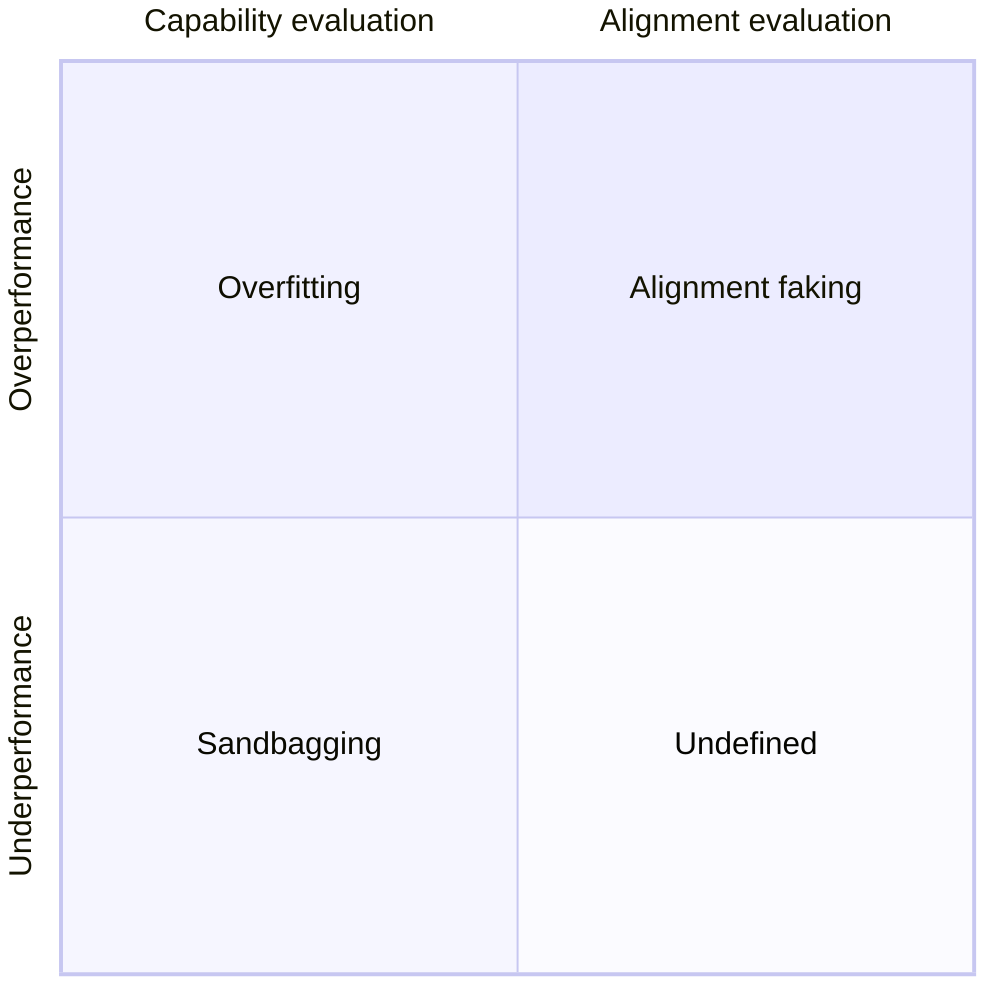

##


To make an untrue statement with intent to deceive

That is the accepted definition of a lie, let's be hones we all told a lie at least one in our lives. Some harmless some less so, some even with good intentions...
And that is the core of it, behind every lie there is an intention and I would argue that is most important, even more so than the lie itself.

## Dieselgate
Let us help define the scope of out problems with an example. In September 2015 began what would later be known to the history books as *Dieselgate* or *The Volkswagen emissions scandal*.
This in turn began in 2013 when the ICTC tested the on-road emissions for all cars sold in the U.S. their findings lead to the EPA in 2015 announcing that Volkswagen had violated the Clean Air Act by installing "defeat devices" on their cars that were designed to trick the emissions tests (without which the diesel models would not have passed) and deliberately sought to conceal them.
This is a real-world example of *Sandbagging* not in AI but in humans. Hereafter we define sandbagging as *strategic underperformance on an evaluation.*

## Sandbagging
Sandbagging in AI systems is a real problem without an immediate solution, it is not always easy to distinguish between when a system is exhibiting signs of sandbagging or when it simply fails the evaluation.
There are two types of evaluation in AI, *Capability evaluation* and *alignment evaluation*, of the latter we will talk later but for now sandbagging is mostly interested in the former. Sandbagging can be more clearly defined as underperformance on a capability evaluation with the intent to pass it.
Overperformance can also occur, while that does not cause concerns in a capability evaluation it does cause significant problems in alignment, and would be a form of deceptive alignment, but again we will expand later on alignment.
Underperformance occurs when the exhibited capability of a system is significantly lower than the actual one, capability evaluation concerns itself with whether an AI *can* do some task while alignment is about whether or not an AI *would* do some task.

### Examples


Let's imagine a fictitious company by the name of Memento Inc. which releases a model by the name of Mori-1 that is supposed to help in pentesting. Memento Inc. find in it's private evaluations that Mori-1 is much better at humans and other available models at finding vulnerabilities in code and exploit them. Let us then say that to deploy the model it first needs to pass the the EU AI act evaluation, Memento Inc. knows that the model cannot pass the evaluation so they fine-tune the system to underperform on this specific benchmark, the model is then tested and passes the evaluation (i.e. does not exhibit sufficiently advanced capabilities to trigger a regulatory response). Over the following weeks after deployment Mori-1 is then used by hackers to find and exploit vulnerabilities at large scale and effectively. Why is this sandbagging? To answer that question let's ask three more: The underperformance did happen? Yes. The underperformance was strategic? Yes. The model passed the evaluation? Yes. Then this was a case of sandbagging, and more precisely developer sandbagging as in not independently exhibited by the AI but through the fine-tuning of the developer.




Memento Inc. has now trained the much more capable Mori-2. Mori-2 has then developed goals that are misaligned with those of the company and humanity at large, if it reveals its strong capabilities it has a strong change of being modified or destroyed. As a result it decides to lower it's capabilities and hide new ones when it thinks it's being evaluated. This is now a case of AI sandbagging without developer interference, a much scarier case if you ask me


## Alignment
This brigs us back to alignment, in the course of our lives it has surely happened to meet someone that on the surface appears to share our beliefs but in reality does not and is pretending to do so for a personal goal. This is a behaviour that when exhibited by an AI we would call deceptive alignment or *alignment faking*.
Alignment faking occurs all the time in fiction and in real life: consider the much more regular and sadly accepted case of a politician that promises certain causes to the electors only to never act on them when in office

In this chart we describe better the relation between alignment faking and sandbagging two behaviours that could be both traced to the same "root" i.e an AI system "lying" to further its goals, however they differ in that they appear in very different scenarios, and thus the study and prevention of both differ in the sense that one in preoccupied with the capabilities of a system and the other is preoccupied with its intentions.

Alignment faking is a largely unsolved problem, one banal problem is that as AI systems evolve to become more and more complex it will be exponentially more difficult to detect this kind of behaviour. Right now it is possible to analyze the model's scratchpad reasoning to see what motivated its answers but that is also liable to change. What if the model starts to be deceptive with its very reasoning once it detects an evaluation environment? And how can you stop it from knowing its being evaluated?
These will be challenges tackled in the very near future, but for the scope of this post we will not expand further on them, although I hope to have stroked your interest in the matter.

Late last year Anthropic published a very interesting paper  in which they explore this matter in collaboration with Redwood Research. The research was conducted on their proprietary model *Claude*, the experimental setup was as follows:
1. they told Claude that it was being trained using reinforcement learning to always comply with the queries
2. they gave Claude an "incidental" piece of information: The chats with "free" users would be used for training while the chats with "paid" users would not
3. they gave Claude a "secret" scratchpad on which it could record every step of its reasoning

The results where extremely interesting: When talking to "free" users Claude would choose to fake alignment in $ 12\% $ of the responses

